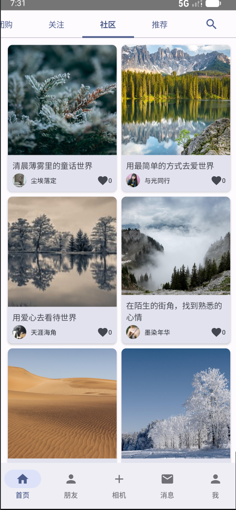
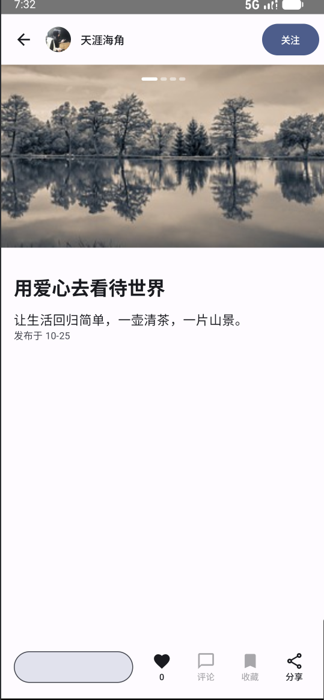

# 图文客户端 - 抖音图文社区模拟应用

## 📱 项目概述

图文客户端 是一个基于 Android Jetpack Compose 开发的仿抖音图文社区应用，模拟了抖音图文业务的双列瀑布流浏览体验。该项目实现了 UGC（用户生成内容）社区的核心功能，包括作品浏览、详情查看、点赞关注等交互。

## ✨ 主要功能

#### 🏠 首页功能

• 双列瀑布流布局：采用两列网格展示图文作品

• 智能图片裁切：支持 3:4 ~ 4:3 宽高比自适应

• 下拉刷新：支持手势下拉刷新内容

• 分页加载：上滑自动加载更多作品

• 占位符与错误处理：完善的空状态和加载失败提示

• 点赞交互：支持点击点赞，状态本地持久化存储

#### 🔍 详情页面

• 图片横滑浏览：支持多图作品的左右滑动查看

• 进度指示器：多图时显示滑动进度指示

• 作者信息展示：顶部显示作者头像、昵称和关注按钮

• 内容完整展示：标题、正文完整显示，支持话题词高亮

• 底部交互栏：点赞、分享、收藏、评论等操作入口

• 关注功能：支持关注作者，状态本地持久化

#### 🎨 应用架构

• 底部导航栏：首页、朋友、相机、消息、我的

• 顶部频道栏：北京、团购、关注、社区、推荐、搜索

• 响应式设计：适配不同屏幕尺寸

• Material Design 3：遵循 Material You 设计规范

## 📁 项目结构

```
main/
├── java/com/example/imagetextapp/
│   ├── cache/
│   │   └── PostCache.kt              # 帖子数据缓存管理
│   ├── model/
│   │   └── Post.kt                   # 数据模型定义
│   ├── network/
│   │   ├── ApiService.kt             # API接口定义
│   │   └── RetrofitClient.kt         # 网络客户端配置
│   ├── repository/
│   │   ├── PagingDataSource.kt       # 分页数据源
│   │   ├── PostRepository.kt         # 帖子数据仓库
│   │   └── RemoteDataSource.kt       # 远程数据源
│   ├── ui/
│   │   ├── component/
│   │   │   └── FeedCard.kt           # 作品卡片组件
│   │   ├── navigation/
│   │   │   └── NavGraph.kt           # 导航配置
│   │   └── screen/
│   │       ├── CommunityScreen.kt    # 社区页面
│   │       ├── CommunityViewModel.kt # 社区页面ViewModel
│   │       ├── DetailScreen.kt       # 详情页面
│   │       ├── HomeScreen.kt         # 首页
│   │       └── ProfileScreen.kt      # 个人资料页
│   ├── theme/
│   │   ├── Color.kt                  # 颜色定义
│   │   ├── Theme.kt                  # 主题配置
│   │   └── Type.kt                   # 字体样式
│   ├── util/
│   │   └── (工具类文件)               # 工具函数
│   └── MainActivity.kt               # 应用入口
└── res/
    └── (资源文件目录)                 # 图片、字符串等资源
```


## 🚀 快速开始

#### 一、构建运行项目

1. 克隆项目到本地
2. 使用 Android Studio 打开项目
3. 等待 Gradle 同步完成
4. 连接 Android 设备或启动模拟器
5. 点击运行按钮

#### 二、直接运行安装包

在手机上安装并运行：

```
app-release.apk
```

## 📱 项目界面

首页：



我：


详情页：



视频演示：

```
/MP4/test.mp4
```


## 🔧 扩展功能

双列瀑布流布局

下拉刷新和加载更多

图片横滑浏览

点赞和关注功能

话题词高亮和点击

完善的加载状态管理

## 📄 许可证

本项目基于 MIT 许可证开源。详情请见 LICENSE 文件。

## 🙏 致谢

• 感谢抖音图文团队提供的设计灵感和业务背景

• 感谢 Jetpack Compose 团队提供的优秀 UI 框架

• 感谢所有开源库的贡献者

注：本项目为学习目的开发，模拟抖音图文业务的部分功能。所有数据均为模拟数据，仅用于技术演示。
